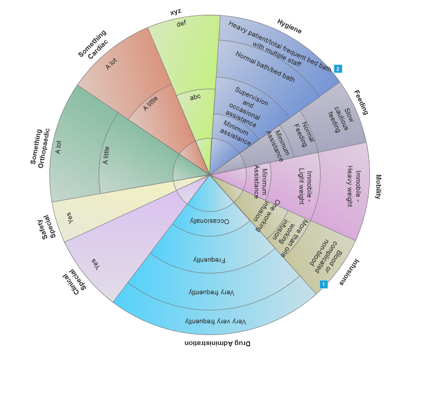

# School of Computing &mdash; Year 4 Project Proposal Form

## SECTION A

|                     |                   |
|---------------------|-------------------|
|Project Title:       | Workload Measurement System for Nurses            |
|Student 1 Name:      | Harley Martin           |
|Student 1 ID:        | 17401932            |
|Student 2 Name:      | Ruth Leavey            |
|Student 2 ID:        | 17323886            |
|Project Supervisor:  | David Sinclair            |

## SECTION B

### Introduction

> This project is the design and development of a workload measurement system for nurses within a hospital. It will provide a much needed insight into the amount of work performed in each ward and therefore will allow management within the hospital to ensure they have the correct number of nurses on each ward to accommodate the work to be done.
>
>Each patient in a ward will have a pie chart associated with them. Each slice of the pie chart is symbolic of a job done by the nurses for that patient, eg. administer medicine. Nurses will log the jobs they have performed for each of their patients and choose a level of difficulty to indicate how much work was required for this job, ie, how much time and effort it took the nurse to complete it. This feature is important because a job may be performed very easily on one patient but the same job may have been much more work on another patient. This information is stored in a database in the cloud and can be accessed by management in the hospital for analysis. This will help the hospital to track how many nurses are needed in each ward so that they can staff the wards appropriately.
>
>The project is explained in more detail below. Please refer to figure 1 in the appendix of this document as an example of some patient’s pie chart.
### Outline

> The system is a mobile application that can be used on smartphones and tablets. Hospitals can use this as they wish, ie. nurses can install the application on their own phones and log the work as they go, or a tablet(s) can be designated for the nurses to share on each ward.
>
>Before the system can be used effectively, it will need to be configured accordingly. A default pie chart will need to be configured. This pie chart will be split into slices, each of which will consist of a possible task undertaken by nurses throughout the hospital.
>
>The system allows management in hospitals to give a value to each of the tasks (in relation to one another) that nurses do for different patients. eg. change dressing, give medicine, etc. These values correspond to how much work a particular task generally requires. Then, for each one of these tasks, they can choose how many levels of difficulty it could be described to have, depending on the circumstances at the time. That is, how hard can the task be.
>
>Provided are two examples to help explain the levels of difficulty that one task or job could have.
>
>A blood transfusion either is performed or it is not. If it is performed, this job always requires the same amount of time and effort. If it is not performed, no time or energy was used so no work was done. This task would have two levels of difficulty, ie the work was done, or the work was not done.
>
>Washing a patient is a task with several difficulty levels. If a patient is independent and can complete the task themselves, no work is done by the nurses. Some patients may need a nurse to assist them in getting to and from the washroom but are capable of washing themselves. A little work is done here. Some patients may need a nurse to walk them to the washroom and also need the nurse to wash them. A little more work is done here by the nurse. Then, some patients may not be able to get out of bed. In this case, a nurse must give the patient a bed bath, which would be considered more work than any of the other situations. This task of washing a patient could have 4 or 5 levels of difficulty. The hospital has the ability to decide how many levels they want to assign to this job.
>
>The system will allow nurses to log the work they perform on each shift. When they perform a task on a patient, they will log the level of difficulty that corresponds to how much work the nurse needed to put in to complete it. If the patient can perform the task on their own, or if the task simply was not required for this particular patient, the nurse will log the lowest level, which equates to zero work done by the nurse.
>
>As mentioned, the system has values associated with each task and the levels of difficulty within them. These values are calculated to give a “weight” to each patient in the ward. This weight indicates how much work was done by the nurses for this patient during the shift. The system combines the weight of all patients in the ward, and gives a weight for the ward itself. The weight of the ward is an insight to how much work was done. This helps management in the hospital see how busy the ward is and decide how many nurses should be staffed there.
>
>All of this data will be processed using real time processing. This is to ensure that the correct and current data information can be accessed by management at any given time i.e management can view a “snapshot” of a given ward at any time they wish.
>
>Management in the hospital will be able to compare the weights of all of the wards in real-time to see which are the heaviest (busiest) wards. They can also view the data over a long period of time and see if any patterns emerge, as patterns often do. Perhaps, during flu season, the hospital sees an influx of patients in one area. Having logged the work during the previous flu season will help predict how much work will be needed and the hospital will know to roster their nurses accordingly.
>
>This project will require the use of many modules studied throughout our course. Systems Analysis & Design modules will help to make sure the project is being designed to meet the user’s needs. Database modules will help us to write to our database and make it easy and efficient to search. Our networking modules will help us in transmitting data from the application to the database in the cloud. Our programming modules will help us develop the design into a working application. Our Communication Skills module will help us to collaborate our work, to document the project professionally and to present it at the end of the year. Our mathematics modules will help us in calculating the correct weights for the jobs the nurses perform. Our Problem Solving module will help us in almost every aspect of the project.

### Background

> With the COVID-19 pandemic currently affecting the lives of everybody worldwide in some shape or form, we were both very interested in making use of this opportunity to have our final year project contribute in some way to the fight against the virus. We wanted our project to be relevant to the current state of the world and to be useful in some way in helping to move forward.
>
>The basis of this project originated from hearing Harley’s aunt, who used to work as a nurse in a hospital, recall a terribly poor workload measurement system that was in place. She recalled that the system was imprecise and vague. Individual measures were not given to the individual jobs being done, which resulted in the implication that the same amount of work went into every job. Only a couple of the most common tasks were accounted for and they all had the same options for different “difficulty levels”. This did not accurately reflect the reality of the work performed by nurses and therefore, it did not actually help management to schedule nurses according to which wards would need more/less work.
>
>We liked the idea of designing and implementing a system to accurately measure the workload in the wards and Harley’s aunt agreed that a more thoughtfully designed system with accurate measurements would be highly appreciated in the healthcare industry.
>
>It has been reported in recent years that hospitals in Ireland have a shortage of nurses so our healthcare system was already under strain before this pandemic. Thus, it is now even more important to ensure the nurses that are available are distributed among hospitals according to where the work is most needed. Our workload measurement system will help point out where in a given hospital the work is needed so that the staff rostering the nurses know where to put them.

### Achievements

>__Who will the users be?__
>
>The users of this system will be the nursing staff of a hospital including nurses and nurse management.
>
>__What functions will the project provide?__
>
>Management will be able to configure the system to suit their own needs. The system allows users to make a pie chart with as many jobs as they wish (within reason, as the slices need to be big enough to easily select one slice without fear of selecting the adjacent slice by accident), and allows them to include as many difficulty levels as they wish for each job (within reason again, as too many sections will make it harder to select the correct one). They can label the slices as they wish and can give each slice (each job) the weight they believe it should be. Some hospitals may believe job X is double the weight of job Y, while others may believe job X should be triple the weight of job Y.
>
>Management will be able to create a default/suggestion pie chart for each ward. Wards are specialised for different types of illness and therefore different treatment. So, some general nursing jobs will be done in all wards, and some will only be done in specific wards. Users can create a default/suggestion pie chart for each ward that contains the most common jobs for this ward. This is basically a suggestion of jobs a patient will need performed. If a patient needs the default tasks for this ward plus one or two more tasks, the extra tasks can be added to the pie chart too. The default pie chart will simply save time in many cases of a new patient instead of creating a whole new pie chart of tasks every time a new patient arrives.
>
>Nurse users will be able to log the amount of work they did for each particular job on each patient during their shift. For each job they perform, they log the level of difficulty to indicate how much work was required to do that job for that patient.
>
>Management users will be able to view the data from the database on graphs. The information displayed to management will represent the data collected in different ways such as:
>
>* The current ward workload score alongside present patients and nurses.
>* A breakdown of the ward workload i.e. what tasks are being logged for each patient, each tasks workload, etc.
>* Ward workload information per shift/day/month/year.
>* Nurse’s compliance rate.
>* Identify and display any recurring workload changes.
>* Identify what may be contributing to any recurring workload changes.
>* The prediction of future workload changes.
>
>This will be achieved through various analytics techniques:
>
>* Descriptive analytics will represent the data that has been collected and be involved in gathering all the information in charts and graphs appropriately to identify any existing patterns and meaning.
>* Diagnostic analytics will be undertaken to help identify how and what is contributing to certain patterns that may be occurring.
>* Predictive/trend analytics will use all data from both descriptive and diagnostic analytics to identify trends related to workload changes and predict future trends that may occur.
>
>It is imperative that our system is user friendly and easily navigable. By this we mean that the application’s user interface needs to be designed so that it is as quick as possible for a nurse to log in, select the patient(s) and log the task(s) that they have just performed. This was mentioned to us when speaking to Ruth’s aunt who was involved in nurse management. She reminded us that nurses are often extremely busy and exist in an extremely fast-paced environment and so this must be prioritised in order to ensure maximum compliance with the system. User testing will be a major part to make sure that we follow this requirement.
>
>The above requirements are based on discussion we have undertaken with nurses and a nurse manager, all of whom we are acquainted with. The positive feedback we have received from them have encouraged us to continue with the proposal of this project. We are aware, however, that the information gathered thus far is not conclusive nor completely sufficient and that we must obtain further input regarding requirements and insight from more possible users in the areas of nursing, nurse management and nurse directing. We have outlined below our intentions of diving deeper into the demographic of users to ensure we cover their needs and we are currently in the process of achieving this.
>
>Using any connections we currently have within the healthcare system, we are requesting the participation from more possible users of our project. These people include nurses in various positions, nurse managers and nurse directors. We are creating official anonymous questionnaires and interviews to be presented to these people where we ask questions to find out any additional requirements and functionality preferences they might have. The anonymity will help to ensure the responses are not biased and the increased number of users supplying information/opinions will provide a more established, balanced and realistic set of requirements. We also are researching online to try to discover any papers or reports posted that may state the need for a system such as ours and hopefully may include some specific requirements for it.

### Justification

>It is well known that hospitals around Ireland are very frequently understaffed. This system will help to discover the amount of work needed. The hospitals can then schedule their own nurses and call upon nurses from nursing agencies when needed. Being able to assign values to the work being done will make it easy to measure the work. Once the hospitals can have an actual value for the work being done, they can assess whether they are equipped well enough to efficiently complete this work or whether they need more nurses and, most importantly, where they need these nurses.
>
>Also, because of the coronavirus pandemic, many Intensive Care Units are extremely busy and some other sectors in the hospital may be quieter due to the country’s many restrictions in place. A lot of people are spending an increased amount of time at home and hence, are likely not doing as many things that could cause accidents and injuries. Many people have the incentive to take care of themselves and their health now more than ever. This would skew the spread of work in the different sections of the hospitals, which could be hard to track without a system such as this.

### Programming language(s)

> SQL
>
>C#
>
>Java
>
>Python

### Programming tools / Tech stack

> Sublime
>
>AWS
>
>Android Studio
>
>Junit

### Hardware

> We expect our PCs and smart devices will be all the hardware required for this project. Ideally, for employment by users, a large touch screen monitor would be best to view the graphs.

### Learning Challenges

> Cloud computing
>
>Role based log in
>
>Python regarding data analysis
>
>Data encryption
>
>C# language
>
>We expect we will need to use some aspects of Java/SQL that we are not yet familiar with
>
>AWS cloud
>
>Data analytics

### Breakdown of work

> Below we have outlined the distribution of work between the two of us for this project. Although we have our own designated tasks, we will help each other out when needed as this is a team project, not individual work. We also know from our experience throughout our time in DCU that one of us often picks up on something the other has missed. With this, we value each other’s view and opinions on the work being done and will likely stray from this breakdown a little and often both participate to some degree on the same task.

#### Student 1

> Harley’s tasks:
>* Write nurse questionnaire
>* Interview nurses I know and ask them to distribute the survey
>* Learn to host database in cloud
>* Generate mock up of nurse listing/patient listing/ward listing to act as data being inputted from hospitals overall system
>* Write normalized relational database
>* Write management user interface of application (including graphics, eg. charts/graphs)
>* Encryption of data

#### Student 2

> Ruth’s tasks:
>* Write management questionnaire 
>* Interview nurses I know and ask them to distribute the survey
>* Learn to host application in cloud 
>* Write nurses interface of application (including graphics, eg. pie charts)
>* Mathematics involved in calculating pie chart slice sizes 
>* Role based log in operation
>* Data analysis

## Example

> Figure 1.

<!-- Example below: Basically, just use HTML! -->

<!-- p align="center"-->
  <!-- img src="./res/cat.png" width="300px"-->
<!--/p-->

	

